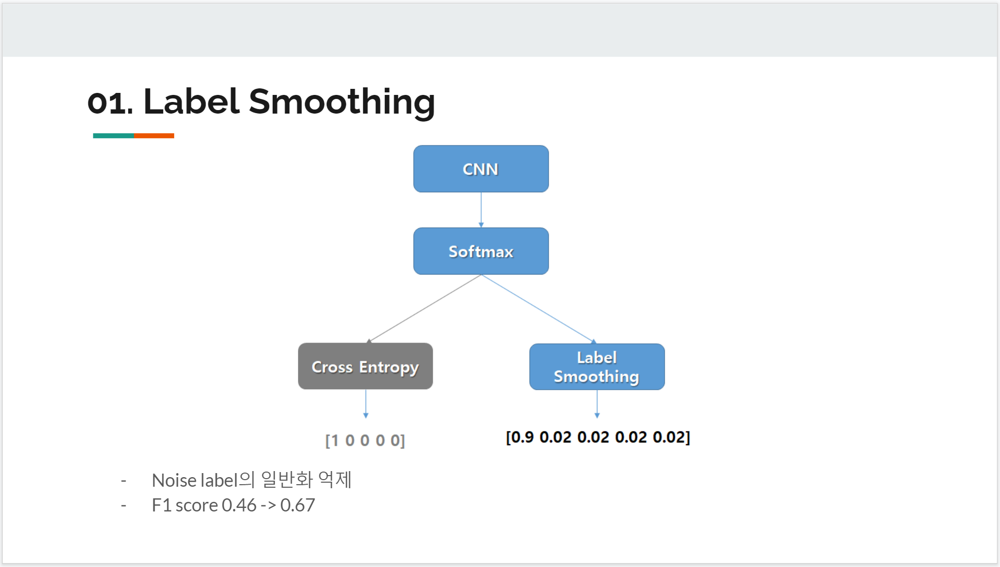
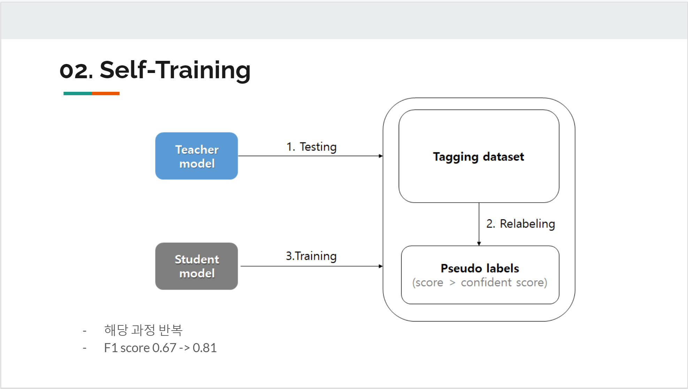
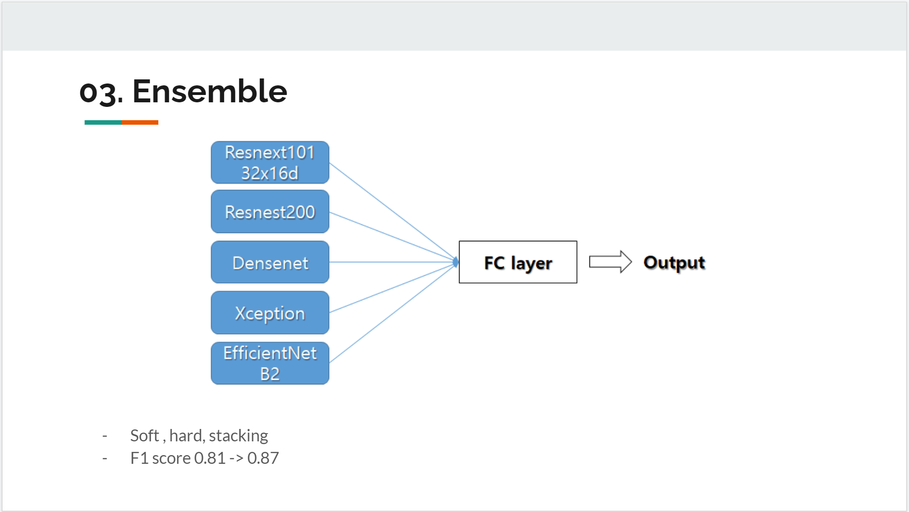
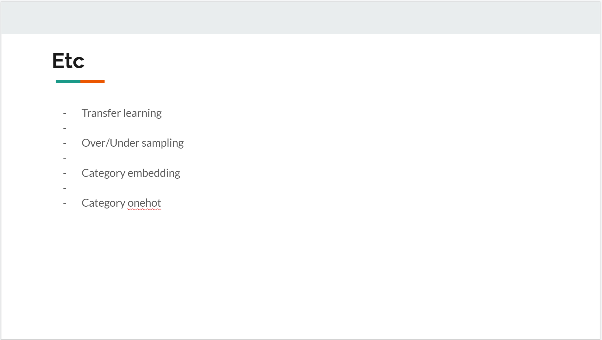

# Tagging Classification

Repo for training a model for the AI Rush tagging classification challenge. The dataset has additional image information which is its category. 
The categories are separated as four parts; primary category(대카테고리), secondary category(중카테고리), third category(소카테고리), and last category(세카테고리). 

## Data
### Description
There are five different classes; 착용샷, 설치 후 배치컷, 요리완성, 발색샷, and 미분류. 
The mapping between class names and the integer values used in the labels file is 
`착용샷: 0, 설치 후 배치컷: 1, 발색샷: 2, 요리완성: 3, 미분류: 4`.

Note that there is an unknown amount of noise in the label.

#### 착용샷
착용샷 is the review image that people are wearing something such as clothes, pants, accessories, and etc.


#### 설치 후 배치컷
설치 후 배치컷 is that the product is located after installation. The furniture is the one of the examples to get those kind of images after installation. 


#### 요리완성
요리완성 is the food image that is completely finished for cooking. 


#### 발색샷
발색샷 is the image that indicates the color by product. For example, lip stick is the one of the representative examples.


#### 미분류
미분류 is the image that is not included in those 4 kinds of classes as shown in the above. 


## Our Model

Our model makes use of several techniques in order to make our model robust to noise in label.








Additionally we make use of additional modules which aim to make use of metadata (i.e. category)



Category embedding is a replacement of making use of category as onehot encoding form. This is done by making each category into a trainable vector (Dimension 18 in our case).

## Metric
Using a geometric mean over all tagging classes.
```
score = (f1_score_착용샷 * f1_score_설치후배치컷 * f1_발색샷 * f1_요리완성 * f1_미분류) ** (1 / 5)
```

## Result

Baseline model (pretrained ResNet50) is 0.549

Our final geometric mean of F1 is 0.880

## Run experiment

To run the baseline model training, run 
```
nsml run -d {DATASET_NAME} -e main.py -g 1 --cpus 4 --memory 16G --shm-size 16G -a "--pretrain --num_epoch 0"
```
You can change the arguments such as learning rate, optimizer, the number of cpus, size of memory, etc.

## Submission 
You can submit your model as follows. 
``` 
nsml submit {SESSION_NAME} {CHECKPOINT}
```
When submitting baseline model, it takes about 145.05 seconds and the score is about 0.46. 

### Format
See AI Rush dataset documentation.

```

