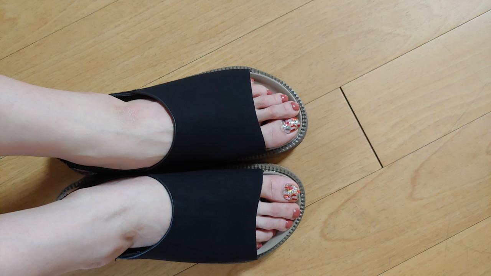
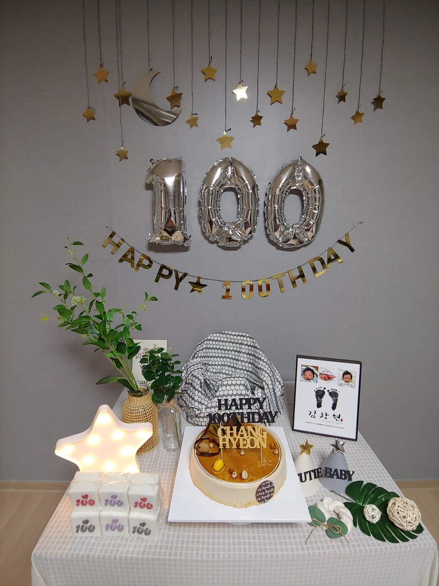
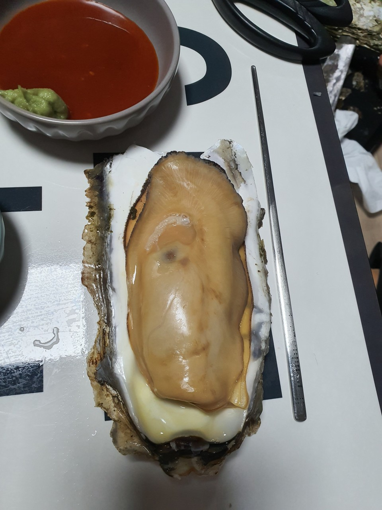
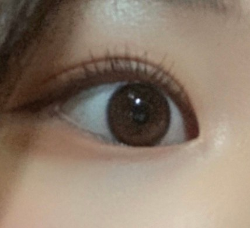
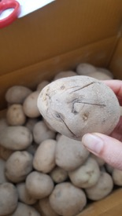

# Tagging Classification

Repo for training a baseline model for the AI Rush tagging classification challenge. The model is just a simple 
ResNet50 model. We have additional image information which is its category. The categories are separated as 
four parts; primary category(대카테고리), secondary category(중카테고리), third category(소카테고리), and last category(세카테고리). 
Hence, you can use both images and their categories for improving the performance.

## Important notes
1. The function that's bind to NSML infer needs to output a dataframe with the two columns `image_name` and `y_pred`,
where `image_name` is the name of the file that's being predicted and `y_pred` is an integer value of the predicted class.

2. Train dataset is only annotated by users. It means that it can be mislabeled. You should build a model which is the 
robust in noisy training set. 

## Run experiment

To run the baseline model training, stand in the `airush2020/tagging` folder and run 
```
nsml run -d {DATASET_NAME} -e main.py -g 1 --cpus 4 --memory 16G --shm-size 16G -a "--pretrain --num_epoch 0"
```
You can change the arguments such as learning rate, optimizer, the number of cpus, size of memory, etc.


## Metric
Using a geometric mean over all tagging classes.
```
score = (f1_score_착용샷 * f1_score_설치후배치컷 * f1_발색샷 * f1_요리완성 * f1_미분류) ** (1 / 5)
```
## Submission 
You can submit your model as follows. 
``` 
nsml submit {SESSION_NAME} {CHECKPOINT}
```
When submitting baseline model, it takes about 145.05 seconds and the score is about 0.46. 

## Data
### Description
There are five different classes; 착용샷, 설치 후 배치컷, 요리완성, 발색샷, and 미분류. 
The mapping between class names and the integer values used in the labels file is 
`착용샷: 0, 설치 후 배치컷: 1, 발색샷: 2, 요리완성: 3, 미분류: 4`.
#### 착용샷
착용샷 is the review image that people are wearing something such as clothes, pants, accessories, and etc. 


#### 설치 후 배치컷
설치 후 배치컷 is that the product is located after installation. The furniture is the one of the examples to get those 
kind of images after installation. 


#### 요리완성
요리완성 is the food image that is completely finished for cooking. 



#### 발색샷
발색샷 is the image that indicates the color by product. For example, lip stick is the one of the representative examples.


#### 미분류
미분류 is the image that is not included in those 4 kinds of classes as shown in the above. 



### Format
See AI Rush dataset documentation.

```

